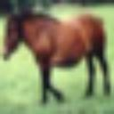
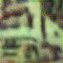

# Arbitrary Style Transfer in Real-time with Adaptive Instance Normalization in PyTorch

This is an unofficial PyTorch implementation of [Arbitrary Style Transfer in Real-time with Adaptive Instance Normalization](https://arxiv.org/abs/1703.06868) by [Harry Yang](www.harryyang.org). The code is adapted from [author's torch implementation AdaIN-style](https://github.com/xunhuang1995/AdaIN-style). 

The code only contains inference (no training part yet). The decoder model and the vgg model are converted from the torch model using this [torch-to-pytorch-convertion](https://github.com/clcarwin/convert_torch_to_pytorch), which, together with the original torch model, could be downloaded from [here](https://drive.google.com/drive/folders/1_p0sCqLCxwZhDs-DnVnQmziQvFprbbzx?usp=sharing). The code was intended to take two random images from CIFAR10 and use them as the content image and style image respectively. We tested the output such that it is identical with the result of the author's torch implementation. 

An example of the result is like this (the content image, the style image and the style transfer result): 

